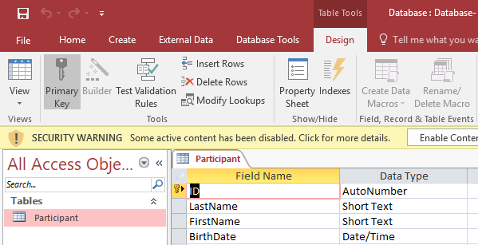
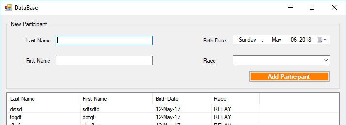

# Windows Forms – Databases - MSAccess
<!-- vscode-markdown-toc -->
* 1. [Objectives](#Objectives)
* 2. [Creating the database](#Creatingthedatabase)
* 3. [Connected Data Access Architecture](#ConnectedDataAccessArchitecture)
	* 3.1. [Assignments (for you to try)](#Assignmentsforyoutotry)
		* 3.1.1. [Assignment 1](#Assignment1)
		* 3.1.2. [Assignment 2](#Assignment2)
* 4. [ Disconnected Data Access Architecture](#DisconnectedDataAccessArchitecture)

<!-- vscode-markdown-toc-config
	numbering=true
	autoSave=true
	/vscode-markdown-toc-config -->
<!-- /vscode-markdown-toc -->
##  1. <a name='Objectives'></a>Objectives
- perform CRUD (Create, Read, Update and Delete) operations using the connected data access approach.
- perform CRUD (Create, Read, Update and Delete) operations using the disconnected data access approach.
- working with multiple related entities.

##  2. <a name='Creatingthedatabase'></a>Creating the database

**Activity**

1. Create the following database in Microsoft Access  

2. Save the database in the "*mdb"format

##  3. <a name='ConnectedDataAccessArchitecture'></a>Connected Data Access Architecture

**Activity**

1. Add the database connection string, as an attribute (“ConnectionString” ) of the “MainForm” class as follows:

	```C#
	public partial class MainForm : Form
	{
		#region Attributes
	    //Best practice
	    //Define the connection string in the settings of the application
	    //string ConnectionString = Properties.Settings.Default.Database;
	    private const string ConnectionString = "Provider = Microsoft.Jet.OLEDB.4.0; Data Source =\"Database.mdb\";Persist Security Info=True";
		private readonly List<Participant> _participants;
		#endregion
		
		. . .
	}
	```
4. Set the tag property for the ListViewItems as follows:

	```c#
	public void DisplayParticipants()
	{
		lvParticipants.Items.Clear();
		
		foreach (Participant participant in _participants)
		{
			var listViewItem = new ListViewItem(participant.LastName);
			listViewItem.SubItems.Add(participant.FirstName);
			listViewItem.SubItems.Add(participant.BirthDate.ToShortDateString());
			
			listViewItem.Tag = participant;
			
			lvParticipants.Items.Add(listViewItem);
		}
	}
	```
5. Add the method that will be used to insert new participants in the database
	
	```c#
	public void AddParticipant(Participant participant)
	{
		var queryString = "insert into Participant(LastName, FirstName, BirthDate)" +
		                      " values(@lastName,@firstName,@birthDate);";

		using (OleDbConnection connection = new OleDbConnection(ConnectionString))
		{
			//1. Open the connection
			connection.Open();

			//2. Add the new participant to the database
			var insertCommand = new OleDbCommand(queryString , connection);
			
			var lastNameParameter = new OleDbParameter("@lastName", participant.LastName);
			var firstNameParameter = new OleDbParameter("@firstName", participant.FirstName);
			var birthDateParameter = new OleDbParameter("@birthDate", participant.BirthDate.Date);
			insertCommand.Parameters.Add(lastNameParameter);
			insertCommand.Parameters.Add(firstNameParameter);
			insertCommand.Parameters.Add(birthDateParameter);

			insertCommand.ExecuteNonQuery();

			//3. Get the Id
			var getIdCommand = new OleDbCommand("SELECT @@Identity;", connection);
			participant.Id = (int) getIdCommand.ExecuteScalar();
			
			//4. Add the new participant to the local collection
			_participants.Add(participant);
		}
	}
	```
7. Change the “btnAdd_Click” event handler as follows:
	
	```c#
	private void btnAdd_Click(object sender, EventArgs e)
	{
		var lastName = tbLastName.Text;
		var firstName = tbFirstName.Text;
		var birthDate = dtpBirthDate.Value;
		
		var participant = new Participant(lastName, firstName, birthDate);
		
		try
		{
			AddParticipant(participant);
			DisplayParticipants();
		}
		catch (Exception ex)
		{
			MessageBox.Show(ex.Message);
		}
	}
	```
8. Add the method that will be used to get the existing participants from the database
		
	```c#
	public void LoadParticipants()
	{
		const string queryString = "SELECT * FROM Participant";

		using (OleDbConnection connection = new OleDbConnection(ConnectionString))
		{
			connection.Open();
			
			OleDbCommand sqlCommand = new OleDbCommand(queryString , connection);
			OleDbDataReader sqlReader = sqlCommand.ExecuteReader();
			try
			{
				while (sqlReader.Read())
				{
					var participant = new Participant(
						(int) sqlReader["Id"], 
						(string) sqlReader["LastName"],
						(string) sqlReader["FirstName"], 
						(DateTime) sqlReader["BirthDate"]);
					_participants.Add(participant);
				}
			}
			finally
			{
				// Always call Close when done reading.
				sqlReader.Close();
			}
		}
	}
	```
9. Handle the Load events of the “MainForm” class as follows:
	
	```c#
	private void MainForm_Load(object sender, EventArgs e)
	{
		try
		{
			LoadParticipants();
			DisplayParticipants();
		}
		catch (Exception ex)
		{
			MessageBox.Show(ex.Message);
		}
	}
	```
10. Add the method that will be used to delete existing participants from the database
		
	```c#
	public void DeleteParticipant(Participant participant)
	{
		const string queryString = "DELETE FROM Participant WHERE Id=@id";

		using (OleDbConnection connection = new OleDbConnection(ConnectionString))
		{
			//Remove from the database
			connection.Open();

			OleDbCommand sqlCommand = new OleDbCommand(queryString , connection);
			var idParameter = new OleDbParameter("@id",participant.Id);
			sqlCommand.Parameters.Add(idParameter);

			sqlCommand.ExecuteNonQuery();

			//Remove from the local copy
			_participants.Remove(participant);
		}
	}
	```
11. Handle the “Delete” button as follows:
	
	```c#
	private void btnDelete_Click(object sender, EventArgs e)
	{
		if (lvParticipants.SelectedItems.Count == 0)
		{
			MessageBox.Show("Choose a participant");
			return;
		}
		
		if (MessageBox.Show("Are you sure?", "Delete participant", MessageBoxButtons.YesNo, MessageBoxIcon.Warning) == DialogResult.Yes)
		{
			try
			{
				DeleteParticipant((Participant) lvParticipants.SelectedItems[0].Tag);
				DisplayParticipants();
			}
			catch (Exception ex)
			{
				MessageBox.Show(ex.Message);
			}
		}
	}
	```
###  3.1. <a name='Assignmentsforyoutotry'></a>Assignments (for you to try)
####  3.1.1. <a name='Assignment1'></a>Assignment 1
1. Implement the edit functionality in order to allow the user to modify the data, for previously entered participants

####  3.1.2. <a name='Assignment2'></a>Assignment 2
1. Allow the user to choose the race in which the user is going to participate as shown bellow. For the complete sample, check the "DatabaseCommandMSAccess2Entities" project in the "code samples" folder. 

	

##  4. <a name='DisconnectedDataAccessArchitecture'></a> Disconnected Data Access Architecture

**Activity**

 Sample Code available at <http://online.ase.ro> – “DatabaseDataAdapterMSAccess” Sample

1. Create a copy of the “BasicListView” project and name it “DatabaseDataAdapterMSAccess”
2. Replace the “ListView” control with a “DataGrid” control (Name: dgvParticipants)
3. Modify the “MainForm” class as follows:

	```c#
	public partial class MainForm : Form
    {
	    private readonly OleDbConnection _dbConnection;
		private readonly OleDbDataAdapter _dbDataAdapter;
	    private readonly DataSet _dsParticipants;

        public MainForm()
        {
			InitializeComponent();

			//Best practice
			//Define the connection string in the settings of the application
			//var dbConnection = new OleDbConnection(Properties.Settings.Default.Database);
			_dbConnection = new OleDbConnection("Provider=Microsoft.Jet.OLEDB.4.0;Data Source=\"Database.mdb\";Persist Security Info=True");

			_dsParticipants = new DataSet();

			_dbDataAdapter = new OleDbDataAdapter();

			var selectCommand = new OleDbCommand("SELECT Id, LastName, FirstName, BirthDate FROM Participant",_dbConnection);
			_dbDataAdapter.SelectCommand = selectCommand;

			var deleteCommand = new OleDbCommand(
				"DELETE FROM Participant WHERE Id = @Id", _dbConnection);
			deleteCommand.Parameters.Add(
				new OleDbParameter("@Id", OleDbType.BigInt, 0, "Id"));
			_dbDataAdapter.DeleteCommand = deleteCommand;

			var insertCommand = new OleDbCommand("INSERT INTO Participant (LastName, FirstName, BirthDate) VALUES (@LastName, @FirstName, @BirthDate);", _dbConnection);
			insertCommand.Parameters.Add(
				new OleDbParameter("@LastName", OleDbType.VarChar, 0, "LastName"));
			insertCommand.Parameters.Add(
				new OleDbParameter("@FirstName", OleDbType.VarChar, 0, "FirstName"));
			insertCommand.Parameters.Add(
				new OleDbParameter("@BirthDate", OleDbType.DBDate, 0, "BirthDate"));
			_dbDataAdapter.InsertCommand = insertCommand;

			var updateCommand = new OleDbCommand("UPDATE Participant SET LastName = @LastName, FirstName=@FirstName, BirthDate = @BirthDate WHERE Id = @Id", _dbConnection);
			updateCommand.Parameters.Add(
				new OleDbParameter("@LastName", OleDbType.VarChar, 0, "LastName"));
			updateCommand.Parameters.Add(
				new OleDbParameter("@FirstName", OleDbType.VarChar, 0, "FirstName"));
			updateCommand.Parameters.Add(
				new OleDbParameter("@BirthDate", OleDbType.DBDate, 0, "BirthDate"));
			updateCommand.Parameters.Add(
				new OleDbParameter("@Id", OleDbType.BigInt, 0, "Id"));
			_dbDataAdapter.UpdateCommand = updateCommand;

			_dbDataAdapter.RowUpdated += _dbDataAdapter_RowUpdated;
		}

		#region Events
		private void MainForm_Load(object sender, EventArgs e)
		{
			try
			{
				_dbDataAdapter.Fill(_dsParticipants, "Participant");
			}
			catch (Exception ex)
			{
				MessageBox.Show(ex.Message);
			}

			//DataBinding Grid
			dgvParticipants.DataSource = _dsParticipants.Tables["Participant"];
			//dgvParticipants.Columns["Id"].Visible = false;
		}

		private void btnAdd_Click(object sender, EventArgs e)
		{
			DataRow newParticipantRow = 
				_dsParticipants.Tables["Participant"].NewRow();

			newParticipantRow["LastName"] = tbLastName.Text;
			newParticipantRow["FirstName"] = tbFirstName.Text;
			newParticipantRow["BirthDate"] = dtpBirthDate.Value;

			_dsParticipants.Tables["Participant"].Rows.Add(newParticipantRow);
		}

		private void btnPersistChanges_Click(object sender, EventArgs e)
		{
			try
			{
				_dbDataAdapter.Update(_dsParticipants, "Participant");
				//_dsParticipants.AcceptChanges();
			}
			catch (Exception ex)
			{
				MessageBox.Show(ex.Message);
			}
		}

		private void _dbDataAdapter_RowUpdated(object sender, System.Data.Common.RowUpdatedEventArgs e)
		{
			//https://msdn.microsoft.com/en-us/library/ks9f57t0%28v=vs.110%29.aspx
			if (e.StatementType == StatementType.Insert)
			{
				var getIdCommand = new OleDbCommand("SELECT @@Identity", _dbConnection);
				e.Row["Id"] = (int)getIdCommand.ExecuteScalar();
			}
		}
		#endregion
	}
	```	